# Text-Summarizer

# Tutorial: Text-Summarizer

This project aims to **summarize long texts** using two distinct methods. It first processes the text to identify key words and sentences, then creates an *extractive summary* by picking the most important original sentences. Additionally, it offers an *abstractive summary* using a powerful Transformer model that generates entirely new, concise text. Finally, the project evaluates the quality of these generated summaries using the **ROUGE metric** to compare them against human-written references.


## Visual Overview


## Chapters

1. [Text Preprocessing
](01_text_preprocessing_.md)
2. [Word Frequency Analysis
](02_word_frequency_analysis_.md)
3. [Sentence Scoring
](03_sentence_scoring_.md)
4. [Extractive Summarization
](04_extractive_summarization_.md)
5. [Abstractive Summarization (Transformer Pipeline)
](05_abstractive_summarization__transformer_pipeline__.md)
6. [ROUGE Evaluation Metric
](06_rouge_evaluation_metric_.md)

---

# Chapter 1: Text Preprocessing

Welcome to the **Text-Summarizer** project! In this journey, you'll learn how to build a system that can take a long piece of text and automatically create a shorter summary. Think of it like a smart assistant that reads an entire article and gives you the most important points without you having to read everything.

Before we can ask our smart assistant to summarize anything, we need to prepare the text itself. Imagine you're about to cook a delicious meal. You wouldn't just throw raw, unwashed ingredients into the pot, right? You'd first clean them, chop them, and remove any unwanted parts like peels or stems.

This "cleaning and preparing" step for text is called **Text Preprocessing**. It's the very first and most crucial step in almost any natural language processing (NLP) task, including text summarization. If our text isn't clean, our summarizer might get confused by irrelevant words, punctuation, or different ways of writing the same word.

In this chapter, we'll learn about the main steps of text preprocessing:

1.  **Tokenization**: Breaking text into individual words.
2.  **Lowercasing**: Making all text uniform (e.g., "Word" becomes "word").
3.  **Punctuation Removal**: Getting rid of symbols like commas and periods.
4.  **Stopword Removal**: Eliminating common, less meaningful words.

Let's dive in and learn how to get our text "cooking-ready"!

## Our Raw Text - The "Unwashed Ingredients"

For our tutorial, we'll use a sample text about World War II. This will be our raw, unprocessed input.

```python
text = """World War II or the Second World War (1 September 1939 – 2 September 1945) was a global conflict between two coalitions: the Allies and the Axis powers. Nearly all of the world's countries participated, with many nations mobilising all resources in pursuit of total war. Tanks and aircraft played major roles, enabling the strategic bombing of cities and delivery of the first and only nuclear weapons ever used in war. World War II was the deadliest conflict in history, resulting in 70 to 85 million deaths, more than half of which were civilians."""
```

This `text` variable holds our raw text. Notice it has capital letters, punctuation, dates, and common words. Our goal is to clean it up so that only the important words remain.

## Setting Up Our Tools

To preprocess text efficiently, we'll use a powerful Python library called `spaCy`. It's great for understanding human language. We'll also need Python's `string` module for punctuation.

```python
import spacy
from spacy.lang.en.stop_words import STOP_WORDS
from string import punctuation
```

First, we load an English language model from `spaCy`. Think of this model as `spaCy`'s brain, allowing it to understand English words and their roles.

```python
nlp = spacy.load('en_core_web_sm')
```

Now, let's turn our raw `text` into a `spaCy` "Doc" object. This `Doc` object is like a special container that `spaCy` uses to hold and process our text.

```python
doc = nlp(text)
```

The `doc` object now contains all our text, but `spaCy` has already done some initial magic behind the scenes, like identifying words and their properties.

## Step 1: Tokenization - Chopping Up the Text

**What it is:** Tokenization is the process of breaking down a large piece of text into smaller units called "tokens." Most often, these tokens are individual words.

**Analogy:** Imagine our text is a whole carrot. Tokenization is like chopping that carrot into small, manageable pieces.

Let's see how `spaCy` automatically tokenizes our text. We can simply iterate through the `doc` object.

```python
# A small example to demonstrate tokenization
small_text = "Hello, World! This is an example."
small_doc = nlp(small_text)
tokens_only = [token.text for token in small_doc]
print(tokens_only)
```

**Output:**

```
['Hello', ',', 'World', '!', 'This', 'is', 'an', 'example', '.']
```

Notice how `spaCy` separates words and punctuation marks like `.` and `,` into their own tokens.

## Step 2: Lowercasing - Making Everything Consistent

**What it is:** Lowercasing converts all characters in the text to their lowercase form. This means "Word," "word," and "WORD" all become "word."

**Why it's important:** For our summarizer, "World" and "world" usually refer to the same concept. If we don't lowercase, the summarizer might treat them as two different words, leading to inaccurate results.

**Analogy:** If you're dicing different vegetables, you want them all roughly the same size and shape for even cooking. Lowercasing gives our words a consistent "shape."

We can easily apply lowercasing while tokenizing:

```python
# Example of lowercasing
tokens_lower = [token.text.lower() for token in small_doc]
print(tokens_lower)
```

**Output:**

```
['hello', ',', 'world', '!', 'this', 'is', 'an', 'example', '.']
```

Now, all words are in lowercase, which is a great start for consistency!

## Step 3: Punctuation Removal - Discarding Unnecessary Marks

**What it is:** Punctuation removal gets rid of all those commas, periods, exclamation marks, and other symbols that often don't contribute directly to the meaning of the text for summarization purposes.

**Why it's important:** Punctuation helps us read and understand sentences, but for tasks like counting important words, they're just noise. "Hello" and "Hello!" should be treated the same.

**Analogy:** When you peel a potato, you remove the skin because you don't typically eat it. Punctuation is like the "skin" of our text.

`spaCy` tokens have a handy attribute called `is_punct` which tells us if a token is a punctuation mark. We can use this to filter them out.

```python
# Example of punctuation removal
tokens_no_punct = [token.text.lower() for token in small_doc if not token.is_punct]
print(tokens_no_punct)
```

**Output:**

```
['hello', 'world', 'this', 'is', 'an', 'example']
```

Much cleaner! We've removed the punctuation and kept only the words.

## Step 4: Stopword Removal - Focusing on Important Words

**What it is:** Stopwords are very common words (like "the," "is," "and," "a," "in") that appear frequently in almost any text but usually don't carry much unique or significant meaning.

**Why it's important:** For summarization, we want to identify the *most informative* words. Stopwords would skew our analysis because they are so common, making other, more specific words seem less important than they are.

**Analogy:** Imagine trying to find the unique flavors in a soup, but you keep tasting a lot of water and salt, which are always there. Stopwords are like the water and salt – essential for language structure but not for identifying the core "flavor" or topics.

`spaCy` provides a built-in list of stopwords, and each token also has an `is_stop` attribute.

```python
# Example of stopword removal
tokens_no_stopwords = [token.text.lower() for token in small_doc if not token.is_punct and not token.is_stop]
print(tokens_no_stopwords)
```

**Output:**

```
['hello', 'world', 'example']
```

Now, the sentence "Hello, World! This is an example." has been reduced to just three meaningful words: "hello", "world", and "example". That's the power of preprocessing!

## Putting All Preprocessing Steps Together

We've seen each step individually, but in practice, we often combine them into a single process. Let's apply all these preprocessing steps to our longer World War II text.

We will loop through each `token` in our `doc` object and apply the conditions:
*   `token.text.lower()`: Convert to lowercase.
*   `not token.is_stop`: Keep only if it's not a stopword.
*   `not token.is_punct`: Keep only if it's not punctuation.
*   `token.text != '\\n'`: Remove newline characters, which are usually for formatting and not meaning.

```python
final_cleaned_tokens = [token.text.lower() for token in doc
                        if not token.is_stop and
                        not token.is_punct and
                        token.text != '\\n'] # Also remove newline characters

print(final_cleaned_tokens[:20]) # Print first 20 tokens to see the result
```

**Output (first 20 cleaned tokens):**

```
['world', 'war', 'ii', 'second', 'world', 'war', '1', 'september', '1939', '2', 'september', '1945', 'global', 'conflict', 'coalitions', 'allies', 'axis', 'powers', 'nearly', 'world']
```

As you can see, our `text` has been transformed into a list of cleaned, lowercase words, free from common words and punctuation. This list of `final_cleaned_tokens` is now ready for further analysis!

## How Text Preprocessing Works Behind the Scenes

Let's visualize the entire preprocessing flow using a simple diagram.


Each step ensures that the text is standardized and contains only the most relevant information for our summarization task.

Here's a quick summary of why each step is important:

| Preprocessing Step     | What it does                                  | Why it's important                                          |
| :--------------------- | :-------------------------------------------- | :---------------------------------------------------------- |
| **Tokenization**       | Breaks text into individual words/units.      | Allows us to analyze words separately.                      |
| **Lowercasing**        | Converts all words to lowercase.              | Ensures "Apple" and "apple" are treated as the same word.   |
| **Punctuation Removal**| Removes symbols like `. , ! ?`.               | Cleans up noise; punctuation rarely carries core meaning.   |
| **Stopword Removal**   | Removes common words like "the," "is," "and." | Focuses analysis on important keywords; reduces data size.  |

## Conclusion

In this chapter, you've learned the fundamental concept of **Text Preprocessing**. We started with raw, messy text and transformed it into a clean, structured list of meaningful words. This process is like washing and chopping ingredients before cooking—it ensures that everything is ready for the next steps and that our final "dish" (the summary) will be high quality.

With our text now prepared, the next logical step is to figure out which of these cleaned words are actually the *most important*! That's exactly what we'll explore in the next chapter: [Word Frequency Analysis](02_word_frequency_analysis_.md).

---

# Chapter 2: Word Frequency Analysis

Welcome back to the **Text-Summarizer** journey! In our last chapter, [Text Preprocessing](01_text_preprocessing_.md), we learned how to clean our raw text, removing distractions like punctuation and common "stop" words. We ended up with a neat list of important-looking words, like the perfectly chopped ingredients for our summarization meal.

Now that our ingredients are ready, the big question is: **Which of these words are actually the most important?** If we want to create a summary, we need to know what the original text is *really* about. This is where **Word Frequency Analysis** comes in!

Imagine you're trying to figure out the main topic of a conversation. You'd probably pay attention to the words that come up again and again, right? If someone keeps saying "dogs," "paws," and "barking," you'd quickly guess they're talking about their furry friends. Word Frequency Analysis does exactly this for our text.

This step calculates how "popular" each word is in our cleaned text. The more frequently a word appears, the more likely it is to be important to the overall meaning. We'll count each word's appearances and then give it a "score" to show its relative importance.

Let's dive in and find out which words are the superstars of our text!

## What is Word Frequency Analysis?

Word Frequency Analysis is an abstraction that helps us understand the significance of individual words. It involves two main steps:

1.  **Counting Word Frequencies**: We go through our list of cleaned words and simply count how many times each unique word appears.
2.  **Normalizing Frequencies**: To make these counts comparable (especially for longer texts or when comparing different documents), we convert them into relative scores. We do this by dividing each word's count by the count of the *most frequent* word in the text. This gives every word a score between 0 and 1, where 1 means it's as popular as the most popular word.

Think of it like a popularity contest:
*   **Step 1 (Counting)**: Each word gets votes based on how many times it appears.
*   **Step 2 (Normalizing)**: We find the word with the most votes (the winner) and then score all other words based on how close their vote count is to the winner's. If the winner got 100 votes, a word with 50 votes gets a score of 0.5 (50/100).

## Our Cleaned Words - Ready for Analysis

From [Chapter 1: Text Preprocessing](01_text_preprocessing_.md), we have our `final_cleaned_tokens` list. This list contains all the meaningful words from our World War II text, all in lowercase, with no punctuation or stopwords.

Let's quickly load that data again to make sure we're on the same page:

```python
import spacy
from spacy.lang.en.stop_words import STOP_WORDS
from string import punctuation
from collections import Counter # We'll need this for counting!

# Our original text from Chapter 1
text = """World War II or the Second World War (1 September 1939 – 2 September 1945) was a global conflict between two coalitions: the Allies and the Axis powers. Nearly all of the world's countries participated, with many nations mobilising all resources in pursuit of total war. Tanks and aircraft played major roles, enabling the strategic bombing of cities and delivery of the first and only nuclear weapons ever used in war. World War II was the deadliest conflict in history, resulting in 70 to 85 million deaths, more than half of which were civilians. Millions died in genocides, including the Holocaust, and by massacres, starvation, and disease. After the Allied victory, Germany, Austria, Japan, and Korea were occupied, and German and Japanese leaders were tried for war crimes.

The causes of World War II included unresolved tensions in the aftermath of World War I and the rises of fascism in Europe and militarism in Japan. Key events preceding the war included Japan's invasion of Manchuria in 1931, the Spanish Civil War, the outbreak of the Second Sino-Japanese War in 1937, and Germany's annexations of Austria and the Sudetenland. World War II is generally considered to have begun on 1 September 1939, when Nazi Germany, under Adolf Hitler, invaded Poland, leading the United Kingdom and France to declare war on Germany. Poland was divided between Germany and the Soviet Union under the Molotov–Ribbentrop Pact. In 1940, the Soviets annexed the Baltic states and parts of Finland and Romania. After the fall of France in June 1940, the war continued mainly between Germany and the British Empire, with fighting in the Balkans, Mediterranean, and Middle East, the aerial Battle of Britain and the Blitz, and naval Battle of the Atlantic. Through campaigns and treaties, Germany gained control of much of continental Europe and formed the Axis alliance with Italy, Japan, and other countries. In June 1941, Germany led an invasion of the Soviet Union, opening the Eastern Front and initially making large territorial gains.

In December 1941, Japan attacked American and British territories in Asia and the Pacific, including at Pearl Harbor in Hawaii, leading the United States to enter the war against Japan and Germany. Japan conquered much of coastal China and Southeast Asia, but its advances in the Pacific were halted in June 1942 at the Battle of Midway. In late 1942, Axis forces were defeated in North Africa and at Stalingrad in the Soviet Union, and in 1943 their continued defeats on the Eastern Front, an Allied invasion of Italy, and Allied offensives in the Pacific forced them into retreat on all fronts. In 1944, the Western Allies invaded France at Normandy as the Soviet Union recaptured its pre-war territory and the U.S. crippled Japan's navy and captured key Pacific islands. The war in Europe concluded with the liberation of German-occupied territories; invasions of Germany by the Western Allies and the Soviet Union, which culminated in the fall of Berlin to Soviet troops; and Germany's unconditional surrender on 8 May 1945. On 6 and 9 August, the U.S. dropped atomic bombs on Hiroshima and Nagasaki in Japan. Faced with an imminent Allied invasion, the prospect of further atomic bombings, and a Soviet declaration of war and invasion of Manchuria, Japan announced its unconditional surrender on 15 August, and signed a surrender document on 2 September 1945.

World War II transformed the political, economic, and social structures of the world, and established the foundation of international relations for the rest of the 20th century and into the 21st century. The United Nations was created to foster international cooperation and prevent future conflicts, with the victorious great powers—China, France, the Soviet Union, the UK, and the U.S.—becoming the permanent members of its security council. The Soviet Union and U.S. emerged as rival global superpowers, setting the stage for the half-century Cold War. In the wake of Europe's devastation, the influence of its great powers waned, triggering the decolonisation of Africa and Asia. Many countries whose industries had been damaged moved towards economic recovery and expansion.\"\"\"

nlp = spacy.load('en_core_web_sm')
doc = nlp(text)

final_cleaned_tokens = [token.text.lower() for token in doc
                        if not token.is_stop and
                        not token.is_punct and
                        token.text != '\\n']
```

## Step 1: Count Word Frequencies

Python's `collections` module has a super useful tool called `Counter`. It's perfect for counting how many times each item appears in a list.

Let's use `Counter` on our `final_cleaned_tokens`:

```python
word_freq = Counter(final_cleaned_tokens)

print("Top 10 most frequent words before normalization:")
for word, count in word_freq.most_common(10):
    print(f"'{word}': {count}")
```

**Output (Example):**
```
Top 10 most frequent words before normalization:
'war': 20
'germany': 11
'japan': 10
'world': 9
'soviet': 9
'union': 7
'ii': 5
'invasion': 5
'september': 4
'allied': 4
```
As you can see, words like "war," "germany," and "japan" appear very often, which makes sense given the topic of our text. This `word_freq` variable is now a dictionary-like object where keys are words and values are their raw counts.

## Step 2: Normalize Word Frequencies

Now that we have the raw counts, we want to normalize them. This means turning them into scores between 0 and 1. To do this, we first need to find the highest frequency count among all words.

```python
# Find the maximum frequency among all words
max_freq = max(word_freq.values())

print(f"The maximum frequency found is: {max_freq}")
```

**Output (Example):**
```
The maximum frequency found is: 20
```
In our example, the word "war" appeared 20 times, which is the highest count.

Now, we'll go through each word's count and divide it by this `max_freq`. This gives us our normalized score:

```python
# Normalize each word's frequency
for word in word_freq.keys():
    word_freq[word] = word_freq[word] / max_freq

print("\nTop 10 most frequent words after normalization:")
# We can't use .most_common() directly on normalized scores with Counter,
# so we'll sort manually for display purposes.
sorted_word_freq = sorted(word_freq.items(), key=lambda x: x[1], reverse=True)
for word, score in sorted_word_freq[:10]:
    print(f"'{word}': {score:.2f}") # Display scores with 2 decimal places
```

**Output (Example):**
```
Top 10 most frequent words after normalization:
'war': 1.00
'germany': 0.55
'japan': 0.50
'world': 0.45
'soviet': 0.45
'union': 0.35
'ii': 0.25
'invasion': 0.25
'september': 0.20
'allied': 0.20
```

Notice how "war" now has a score of 1.0 (because 20/20 = 1). "Germany" has 0.55 (11/20), and so on. Every word now has a score that shows its importance *relative* to the most popular word in the text. These scores are super valuable because they tell us which words are central to the text's topic, after getting rid of all the noise.

## How Word Frequency Analysis Works Behind the Scenes

Let's visualize the simple flow of how we arrived at our normalized word scores.


This diagram shows that our cleaned words first go into a counter, which gives us raw counts. Then, we find the highest count among these. Finally, a normalizer uses this highest count to convert all raw counts into our final importance scores.

## Summary of Word Frequency Analysis Steps

Here's a quick look at the steps we followed:

| Step                         | What it does                                                 | Why it's important                                          |
| :--------------------------- | :----------------------------------------------------------- | :---------------------------------------------------------- |
| **Count Frequencies**        | Determines how many times each unique word appears in the text. | Identifies words that are repeatedly mentioned.             |
| **Find Maximum Frequency**   | Locates the highest count achieved by any word.              | Essential for scaling all other word frequencies.           |
| **Normalize Frequencies**    | Divides each word's frequency by the maximum frequency.      | Creates a relative importance score (0 to 1), making scores comparable across texts. |

## Conclusion

In this chapter, you've learned how to perform **Word Frequency Analysis**. We took the cleaned words from our previous step and turned them into valuable "importance scores." These scores now tell us which words are the main drivers of the text's meaning. We've gone from raw text to identifying its key vocabulary!

With these word importance scores, we're now ready for the next exciting step: using these scores to figure out which *sentences* are the most important. That's what we'll cover in the next chapter: [Sentence Scoring](03_sentence_scoring_.md).

---

# Chapter 3: Sentence Scoring

Welcome back to the **Text-Summarizer** project! In our last chapter, [Word Frequency Analysis](02_word_frequency_analysis_.md), we learned how to identify the "superstar" words in our text by giving them importance scores based on how often they appear. We now have a clear idea of which individual words are most central to our document's topic.

But a summary isn't just a list of words; it's a collection of key *sentences* that convey the main ideas. So, the next big question is: **How do we use our word importance scores to find the most important sentences?**

Imagine you have a recipe for a delicious cake, and you know which ingredients are most crucial (like sugar, flour, and eggs). Now, you need to decide which *steps* in the recipe are most important to ensure the cake turns out perfectly. You'd probably look for steps that mention those key ingredients, right?

**Sentence Scoring** is exactly like this. It's the process of giving each sentence in our document a numerical score. This score helps us understand how relevant and informative a sentence is, based on the important words it contains. Sentences with higher scores are more likely to be the "main idea" sentences we want for our summary.

Let's learn how to score our sentences and get closer to building our smart summarizer!

## What is Sentence Scoring?

Sentence Scoring is an abstraction that assigns a numerical value to each sentence in a document. This value helps us rank sentences by their importance.

Here's how it works:

1.  **Break text into sentences:** First, we need to separate our long document into individual sentences.
2.  **Score each sentence:** For each sentence, we look at all the important words it contains. We sum up the normalized frequency scores of these words (which we calculated in [Word Frequency Analysis](02_word_frequency_analysis_.md)).
3.  **Identify key sentences:** Sentences that accumulate higher total scores are considered more significant, as they contain more of the document's key terms.

Think of it like this: Each word has a "power level" (its normalized frequency score). When words combine into a sentence, their power levels add up. A sentence with many powerful words will have a high total power level, indicating it's a very important sentence!

## Setting Up Our Tools

To perform sentence scoring, we'll need the following from our previous chapters:

*   Our `doc` object (from `spaCy`) which contains our entire text, already processed and ready for sentence and word-level access.
*   Our `word_freq` dictionary, which holds the normalized importance scores for each cleaned word.

Let's quickly load our text and necessary data to pick up where we left off:

```python
import spacy
from spacy.lang.en.stop_words import STOP_WORDS
from string import punctuation
from collections import Counter

# Our original text from Chapter 1 (extended version from Chapter 2)
text = """World War II or the Second World War (1 September 1939 – 2 September 1945) was a global conflict between two coalitions: the Allies and the Axis powers. Nearly all of the world's countries participated, with many nations mobilising all resources in pursuit of total war. Tanks and aircraft played major roles, enabling the strategic bombing of cities and delivery of the first and only nuclear weapons ever used in war. World War II was the deadliest conflict in history, resulting in 70 to 85 million deaths, more than half of which were civilians. Millions died in genocides, including the Holocaust, and by massacres, starvation, and disease. After the Allied victory, Germany, Austria, Japan, and Korea were occupied, and German and Japanese leaders were tried for war crimes.

The causes of World War II included unresolved tensions in the aftermath of World War I and the rises of fascism in Europe and militarism in Japan. Key events preceding the war included Japan's invasion of Manchuria in 1931, the Spanish Civil War, the outbreak of the Second Sino-Japanese War in 1937, and Germany's annexations of Austria and the Sudetenland. World War II is generally considered to have begun on 1 September 1939, when Nazi Germany, under Adolf Hitler, invaded Poland, leading the United Kingdom and France to declare war on Germany. Poland was divided between Germany and the Soviet Union under the Molotov–Ribbentrop Pact. In 1940, the Soviets annexed the Baltic states and parts of Finland and Romania. After the fall of France in June 1940, the war continued mainly between Germany and the British Empire, with fighting in the Balkans, Mediterranean, and Middle East, the aerial Battle of Britain and the Blitz, and naval Battle of the Atlantic. Through campaigns and treaties, Germany gained control of much of continental Europe and formed the Axis alliance with Italy, Japan, and other countries. In June 1941, Germany led an invasion of the Soviet Union, opening the Eastern Front and initially making large territorial gains.

In December 1941, Japan attacked American and British territories in Asia and the Pacific, including at Pearl Harbor in Hawaii, leading the United States to enter the war against Japan and Germany. Japan conquered much of coastal China and Southeast Asia, but its advances in the Pacific were halted in June 1942 at the Battle of Midway. In late 1942, Axis forces were defeated in North Africa and at Stalingrad in the Soviet Union, and in 1943 their continued defeats on the Eastern Front, an Allied invasion of Italy, and Allied offensives in the Pacific forced them into retreat on all fronts. In 1944, the Western Allies invaded France at Normandy as the Soviet Union recaptured its pre-war territory and the U.S. crippled Japan's navy and captured key Pacific islands. The war in Europe concluded with the liberation of German-occupied territories; invasions of Germany by the Western Allies and the Soviet Union, which culminated in the fall of Berlin to Soviet troops; and Germany's unconditional surrender on 8 May 1945. On 6 and 9 August, the U.S. dropped atomic bombs on Hiroshima and Nagasaki in Japan. Faced with an imminent Allied invasion, the prospect of further atomic bombings, and a Soviet declaration of war and invasion of Manchuria, Japan announced its unconditional surrender on 15 August, and signed a surrender document on 2 September 1945.

World War II transformed the political, economic, and social structures of the world, and established the foundation of international relations for the rest of the 20th century and into the 21st century. The United Nations was created to foster international cooperation and prevent future conflicts, with the victorious great powers—China, France, the Soviet Union, the UK, and the U.S.—becoming the permanent members of its security council. The Soviet Union and U.S. emerged as rival global superpowers, setting the stage for the half-century Cold War. In the wake of Europe's devastation, the influence of its great powers waned, triggering the decolonisation of Africa and Asia. Many countries whose industries had been damaged moved towards economic recovery and expansion."""

nlp = spacy.load('en_core_web_sm')
doc = nlp(text)

# Re-creating final_cleaned_tokens from Chapter 1 for word_freq calculation
final_cleaned_tokens = [token.text.lower() for token in doc
                        if not token.is_stop and
                        not token.is_punct and
                        token.text != '\\n']

# Re-creating normalized word_freq from Chapter 2
word_freq = Counter(final_cleaned_tokens)
max_freq = max(word_freq.values())
for word in word_freq.keys():
    word_freq[word] = word_freq[word] / max_freq

# 'word_freq' now contains normalized importance scores for words like {'war': 1.0, 'germany': 0.55, ...}
```

## Step 1: Get Individual Sentences

`spaCy` is excellent at automatically detecting sentence boundaries. Our `doc` object already has this information! We can access individual sentence objects using `doc.sents`.

```python
# Create a list of the actual sentence strings
sentences = [sent.text for sent in doc.sents]

print(f"Total sentences found: {len(sentences)}")
print("First two sentences:")
print(sentences[0])
print(sentences[1])
```

**Output (Example):**
```
Total sentences found: 26
First two sentences:
World War II or the Second World War (1 September 1939 – 2 September 1945) was a global conflict between two coalitions: the Allies and the Axis powers.
Nearly all of the world's countries participated, with many nations mobilising all resources in pursuit of total war.
```
This gives us a clean list of all sentences, ready to be scored.

## Step 2: Score Each Sentence

Now, we'll go through each sentence and calculate its total score. We do this by:
1.  Initializing a score of `0` for the current sentence.
2.  Iterating through each *word* (token) within that sentence.
3.  For each word, we convert it to lowercase and check if it exists in our `word_freq` dictionary (our list of important words with their scores).
4.  If the word is in `word_freq`, we add its score to the current sentence's total.

```python
sentence_scores = {}
for sentence_obj in doc.sents: # Iterate over spaCy sentence objects
    current_sentence_score = 0
    # Loop through each word (token) in the current sentence
    for word_token in sentence_obj:
        word_text_lower = word_token.text.lower()
        
        # Check if this lowercased word exists in our word_freq dictionary.
        # Remember, word_freq only contains important words (no stopwords/punctuation).
        if word_text_lower in word_freq:
            current_sentence_score += word_freq[word_text_lower]
            
    # Store the score for the full original sentence text
    sentence_scores[sentence_obj.text] = current_sentence_score

print("\nScores for the first few sentences:")
# Print the sentence and its score for the first 5 entries
for i, (sent, score) in enumerate(sentence_scores.items()):
    if i >= 5:
        break
    print(f"Sentence: \"{sent[:70]}...\"\nScore: {score:.2f}\n")
```

**Output (Example):**
```
Scores for the first few sentences:
Sentence: "World War II or the Second World War (1 September 1939 – 2 Septem..."
Score: 0.40

Sentence: "Nearly all of the world's countries participated, with many nation..."
Score: 0.45

Sentence: "Tanks and aircraft played major roles, enabling the strategic bomb..."
Score: 0.50

Sentence: "World War II was the deadliest conflict in history, resulting in 7..."
Score: 0.45

Sentence: "Millions died in genocides, including the Holocaust, and by massa..."
Score: 0.15
```
Now, every sentence has a score! Notice how the scores vary. Some sentences have higher scores because they contain more of the "important" words we identified in the previous chapter.

## How Sentence Scoring Works Behind the Scenes

Let's visualize the flow of how we transform our document into a list of scored sentences.


This diagram shows that the `spaCy Doc` first extracts sentences. Then, the `Sentence Processor` combines these sentences with the `Word Importance Scores` (from [Word Frequency Analysis](02_word_frequency_analysis_.md)) to calculate a final score for each sentence.

## Summary of Sentence Scoring Steps

Here's a quick recap of the process:

| Step                         | What it does                                                 | Why it's important                                          |
| :--------------------------- | :----------------------------------------------------------- | :---------------------------------------------------------- |
| **Sentence Tokenization**    | Breaks the entire text into individual sentences.            | Allows us to evaluate sentences as meaningful units.        |
| **Score Aggregation**        | Sums the normalized frequency scores of important words within each sentence. | Quantifies a sentence's overall relevance to the document's main topic. |

## Conclusion

In this chapter, you've learned the crucial concept of **Sentence Scoring**. We've moved from identifying important individual words to identifying the most important sentences in a document. By summing up the "power levels" of key words, we can now numerically rank each sentence based on its relevance.

With our sentences now scored and ranked, we're just one step away from generating an actual summary! The next exciting phase is to use these scores to select the best sentences and combine them into a coherent summary. That's what we'll dive into in the next chapter: [Extractive Summarization](04_extractive_summarization_.md).

---

# Chapter 4: Extractive Summarization

Welcome back to the **Text-Summarizer** project! In our last chapter, [Sentence Scoring](03_sentence_scoring_.md), we accomplished a major feat: we assigned an importance score to every single sentence in our document. We now know which sentences carry the most "punch" and are most relevant to the text's overall topic.

Now, the exciting part begins! With these scores in hand, how do we finally create the actual summary? This is where **Extractive Summarization** comes into play. It's the method we'll use to turn our ranked sentences into a concise, meaningful summary.

Imagine you're trying to quickly grasp the main points of a long news article. Instead of rewriting it, you might just highlight the most important sentences and then read only those highlighted parts. Extractive summarization works in a very similar way. It identifies the most crucial sentences and simply pulls them out, stitches them together, and presents them as the summary.

It's like carefully selecting the best slices from a delicious cake – you don't bake a new cake, you just pick the most flavorful existing pieces!

## What is Extractive Summarization?

**Extractive Summarization** is a method that directly selects and extracts the most important sentences from the original text to form a summary. It doesn't generate new sentences or rephrase existing ones. Instead, it acts like a meticulous highlighter, picking out the sentences that best represent the core content, usually based on their assigned scores.

The key idea is to identify the sentences that are most "representative" of the entire document and include them in the final summary. This approach guarantees that the summary's sentences are grammatically correct and coherent, as they come directly from the original source.

## How Extractive Summarization Works

To create an extractive summary, we follow these logical steps:

1.  **Determine Summary Length**: Decide how long you want the summary to be (e.g., the top 3 sentences, or a certain percentage of the original text).
2.  **Sort Sentences by Score**: Arrange all available sentences from the highest importance score to the lowest.
3.  **Select Top Sentences**: Pick the number of sentences you determined in step 1 from the top of the sorted list.
4.  **Order and Assemble Summary**: Combine the selected sentences. It's usually best to present them in their original order of appearance in the document to maintain readability and logical flow.

Let's put this into practice using our World War II text!

## Setting Up Our Tools (Recap from Previous Chapters)

To perform extractive summarization, we need the `sentence_scores` dictionary we created in [Chapter 3: Sentence Scoring](03_sentence_scoring_.md). This dictionary maps each original sentence to its calculated importance score.

Let's re-run the necessary setup to get our `word_freq` and `sentence_scores` ready. This code block will load our text, preprocess it, calculate word frequencies, and then score all sentences.

```python
import spacy
from spacy.lang.en.stop_words import STOP_WORDS
from string import punctuation
from collections import Counter # For counting word frequencies

# Our original text from Chapter 1 (extended version from Chapter 2)
text = """World War II or the Second World War (1 September 1939 – 2 September 1945) was a global conflict between two coalitions: the Allies and the Axis powers. Nearly all of the world's countries participated, with many nations mobilising all resources in pursuit of total war. Tanks and aircraft played major roles, enabling the strategic bombing of cities and delivery of the first and only nuclear weapons ever used in war. World War II was the deadliest conflict in history, resulting in 70 to 85 million deaths, more than half of which were civilians. Millions died in genocides, including the Holocaust, and by massacres, starvation, and disease. After the Allied victory, Germany, Austria, Japan, and Korea were occupied, and German and Japanese leaders were tried for war crimes.

The causes of World War II included unresolved tensions in the aftermath of World War I and the rises of fascism in Europe and militarism in Japan. Key events preceding the war included Japan's invasion of Manchuria in 1931, the Spanish Civil War, the outbreak of the Second Sino-Japanese War in 1937, and Germany's annexations of Austria and the Sudetenland. World War II is generally considered to have begun on 1 September 1939, when Nazi Germany, under Adolf Hitler, invaded Poland, leading the United Kingdom and France to declare war on Germany. Poland was divided between Germany and the Soviet Union under the Molotov–Ribbentrop Pact. In 1940, the Soviets annexed the Baltic states and parts of Finland and Romania. After the fall of France in June 1940, the war continued mainly between Germany and the British Empire, with fighting in the Balkans, Mediterranean, and Middle East, the aerial Battle of Britain and the Blitz, and naval Battle of the Atlantic. Through campaigns and treaties, Germany gained control of much of continental Europe and formed the Axis alliance with Italy, Japan, and other countries. In June 1941, Germany led an invasion of the Soviet Union, opening the Eastern Front and initially making large territorial gains.

In December 1941, Japan attacked American and British territories in Asia and the Pacific, including at Pearl Harbor in Hawaii, leading the United States to enter the war against Japan and Germany. Japan conquered much of coastal China and Southeast Asia, but its advances in the Pacific were halted in June 1942 at the Battle of Midway. In late 1942, Axis forces were defeated in North Africa and at Stalingrad in the Soviet Union, and in 1943 their continued defeats on the Eastern Front, an Allied invasion of Italy, and Allied offensives in the Pacific forced them into retreat on all fronts. In 1944, the Western Allies invaded France at Normandy as the Soviet Union recaptured its pre-war territory and the U.S. crippled Japan's navy and captured key Pacific islands. The war in Europe concluded with the liberation of German-occupied territories; invasions of Germany by the Western Allies and the Soviet Union, which culminated in the fall of Berlin to Soviet troops; and Germany's unconditional surrender on 8 May 1945. On 6 and 9 August, the U.S. dropped atomic bombs on Hiroshima and Nagasaki in Japan. Faced with an imminent Allied invasion, the prospect of further atomic bombings, and a Soviet declaration of war and invasion of Manchuria, Japan announced its unconditional surrender on 15 August, and signed a surrender document on 2 September 1945.

World War II transformed the political, economic, and social structures of the world, and established the foundation of international relations for the rest of the 20th century and into the 21st century. The United Nations was created to foster international cooperation and prevent future conflicts, with the victorious great powers—China, France, the Soviet Union, the UK, and the U.S.—becoming the permanent members of its security council. The Soviet Union and U.S. emerged as rival global superpowers, setting the stage for the half-century Cold War. In the wake of Europe's devastation, the influence of its great powers waned, triggering the decolonisation of Africa and Asia. Many countries whose industries had been damaged moved towards economic recovery and expansion."""

# Load spaCy model
nlp = spacy.load('en_core_web_sm')
doc = nlp(text)

# --- Re-creating word_freq (from Chapter 1 & 2) ---
final_cleaned_tokens = [token.text.lower() for token in doc
                        if not token.is_stop and
                        not token.is_punct and
                        token.text != '\\n']
word_freq = Counter(final_cleaned_tokens)
max_freq = max(word_freq.values())
for word in word_freq.keys():
    word_freq[word] = word_freq[word] / max_freq

# --- Re-creating sentence_scores (from Chapter 3) ---
sentence_scores = {}
for sentence_obj in doc.sents:
    current_sentence_score = 0
    for word_token in sentence_obj:
        word_text_lower = word_token.text.lower()
        if word_text_lower in word_freq:
            current_sentence_score += word_freq[word_text_lower]
    sentence_scores[sentence_obj.text] = current_sentence_score

# 'sentence_scores' is now ready, mapping each sentence to its importance score.
```
After running this setup, our `sentence_scores` dictionary is fully populated, containing every sentence from our text and its calculated score.

## Step 1 & 2: Decide Length and Select Top Sentences

First, we need to decide how many sentences we want in our summary. For this example, let's say we want the **top 3 most important sentences**.

To get these, we can use a handy Python tool called `heapq.nlargest`. This function efficiently finds the `n` largest values (or items based on a key) in a collection without having to fully sort everything.

```python
from heapq import nlargest # Import the tool

# Define how many sentences we want in our summary
num_sentences = 3

# Use nlargest to get the top 'num_sentences' from our sentence_scores dictionary.
# The 'key=sentence_scores.get' tells nlargest to compare sentences based on their scores.
selected_sentences = nlargest(num_sentences, sentence_scores, key=sentence_scores.get)

print("The 3 top-scoring sentences (in no particular order yet):")
for sent in selected_sentences:
    print(f"- {sent[:70]}...") # Print a snippet of each sentence
```

**Output (Example):**
```
The 3 top-scoring sentences (in no particular order yet):
- Faced with an imminent Allied invasion, the prospect of further atomi...
- The war in Europe concluded with the liberation of German-occupied te...
- Key events preceding the war included Japan's invasion of Manchuria i...
```
Now, `selected_sentences` contains the text of our top 3 most important sentences!

## Step 3 & 4: Order and Assemble the Summary

The `nlargest` function returns sentences based purely on their scores, which means they might not be in the original order they appeared in the document. For a readable summary, it's crucial to put them back in the order they were in the original text.

To do this, we'll iterate through all the original sentences in our `doc` object (which preserves order) and check if each sentence is one of our `selected_sentences`. If it is, we add it to our final summary list.

```python
final_summary_sentences = []
# Iterate through sentences in their original order from the spaCy doc
for sentence_obj in doc.sents:
    if sentence_obj.text in selected_sentences:
        final_summary_sentences.append(sentence_obj.text)

# Join the sentences with a space to form the final summary
summary = " ".join(final_summary_sentences)

print("\n--- Extractive Summary ---")
print(summary)
```

**Output (Example):**
```
--- Extractive Summary ---
Key events preceding the war included Japan's invasion of Manchuria in 1931, the Spanish Civil War, the outbreak of the Second Sino-Japanese War in 1937, and Germany's annexations of Austria and the Sudetenland. The war in Europe concluded with the liberation of German-occupied territories; invasions of Germany by the Western Allies and the Soviet Union, which culminated in the fall of Berlin to Soviet troops; and Germany's unconditional surrender on 8 May 1945. Faced with an imminent Allied invasion, the prospect of further atomic bombings, and a Soviet declaration of war and invasion of Manchuria, Japan announced its unconditional surrender on 15 August, and signed a surrender document on 2 September 1945.
```
And there you have it! A concise, extractive summary of our World War II text, made by selecting the three most important sentences based on our word and sentence scoring.

## How Extractive Summarization Works Behind the Scenes

Let's visualize the entire flow of how we created our extractive summary, from scored sentences to the final output.


This diagram shows that after scoring, we first pick the *best* sentences based on their scores, regardless of order. Then, to make the summary readable, we refer back to the original text's structure to ensure the selected sentences are presented in their proper sequence. Finally, these ordered sentences are joined together to form the complete extractive summary.

## Summary of Extractive Summarization Steps

Here’s a quick overview of the stages involved in building an extractive summary:

| Step                         | What it does                                                 | Why it's important                                          |
| :--------------------------- | :----------------------------------------------------------- | :---------------------------------------------------------- |
| **Determine Length**         | Sets the desired number of sentences for the summary.       | Controls the brevity and detail of the summary.             |
| **Select Top Sentences**     | Identifies sentences with the highest importance scores.     | Ensures only the most relevant content is considered.       |
| **Reorder Sentences**        | Arranges the selected sentences in their original document order. | Maintains coherence and readability for the final summary. |
| **Assemble Summary**         | Combines the reordered sentences into a single, cohesive text. | Forms the final, easy-to-read summary.                      |

## Conclusion

In this chapter, you've learned the fundamental concept of **Extractive Summarization**. You've seen how to leverage the sentence scores calculated in the previous step to identify and select the most important sentences. By combining `heapq.nlargest` with a simple reordering logic, we successfully generated a concise summary that directly reflects the key information from the original document.

This is a powerful and interpretable method for summarization, as every sentence in the summary is guaranteed to be an original, grammatically correct sentence from the source text.

While extractive summarization is great for highlighting key parts, what if we want a summary that expresses ideas in *new* sentences, perhaps even combining information from different parts of the original text? That's the realm of **Abstractive Summarization**, which we will explore in the next exciting chapter: [Abstractive Summarization (Transformer Pipeline)](05_abstractive_summarization__transformer_pipeline__.md).

---

# Chapter 5: Abstractive Summarization (Transformer Pipeline)

Welcome back to the **Text-Summarizer** project! In our last chapter, [Extractive Summarization](04_extractive_summarization_.md), you learned how to create a summary by picking out the most important sentences directly from the original text. It's like highlighting the key parts of an article. This method is straightforward and ensures grammatical correctness because it uses existing sentences.

However, sometimes we want a summary that's more like what a human would write. When a person summarizes something, they don't just copy sentences; they read, understand the main points, and then **rephrase** them in their own words, often creating entirely new sentences. This is where **Abstractive Summarization** comes in!

Imagine you've read a long news article, and a friend asks you for the gist. You wouldn't recite three sentences word-for-word from the article. Instead, you'd briefly explain the core ideas in new, concise sentences. Abstractive summarization aims to do just that: understand the content and generate a summary that rephrases and creates new, fluent sentences, capturing the essence of the original text.

This chapter will introduce you to this more advanced method, using powerful modern AI models called **Transformers**, which are made incredibly easy to use with the **Hugging Face Pipeline**.

## What is Abstractive Summarization?

**Abstractive Summarization** is an advanced method that generates a summary by creating new sentences, rather than just extracting existing ones. It aims to understand the meaning and context of the original text and then rewrite it in a shorter, more concise form.

Here's why it's powerful:

*   **Rephrasing**: It can reword complex phrases into simpler ones.
*   **New Sentences**: It can combine information from multiple parts of the source text into a single, brand-new sentence.
*   **Fluency**: The generated summary often sounds more natural and human-like.

Think of it as having a super-smart assistant who reads your document and then writes a completely fresh, shorter version for you, highlighting the main points in its own words.

## Our Tool: Hugging Face Transformers Pipeline

Building a complex AI model from scratch for abstractive summarization can be very challenging. Thankfully, the **Hugging Face `transformers` library** provides pre-trained models and a super user-friendly tool called a **pipeline** that lets us use these powerful models with just a few lines of code!

A `pipeline` acts like a ready-to-use function that takes your input text, feeds it to a sophisticated Transformer model, and gives you the summary, all without you needing to know the complex details of how the model works internally.

For abstractive summarization, we'll use a model like `t5-base`, which is specifically designed for text-to-text tasks, including summarization.

## Solving the Use Case: Generating an Abstractive Summary

Let's use the same World War II text from previous chapters and generate an abstractive summary.

First, we need to install the `transformers` library if you haven't already.

```python
!pip install transformers
```

Now, let's load our `text` from previous chapters.

```python
text = """World War II or the Second World War (1 September 1939 – 2 September 1945) was a global conflict between two coalitions: the Allies and the Axis powers. Nearly all of the world's countries participated, with many nations mobilising all resources in pursuit of total war. Tanks and aircraft played major roles, enabling the strategic bombing of cities and delivery of the first and only nuclear weapons ever used in war. World War II was the deadliest conflict in history, resulting in 70 to 85 million deaths, more than half of which were civilians. Millions died in genocides, including the Holocaust, and by massacres, starvation, and disease. After the Allied victory, Germany, Austria, Japan, and Korea were occupied, and German and Japanese leaders were tried for war crimes.

The causes of World War II included unresolved tensions in the aftermath of World War I and the rises of fascism in Europe and militarism in Japan. Key events preceding the war included Japan's invasion of Manchuria in 1931, the Spanish Civil War, the outbreak of the Second Sino-Japanese War in 1937, and Germany's annexations of Austria and the Sudetenland. World War II is generally considered to have begun on 1 September 1939, when Nazi Germany, under Adolf Hitler, invaded Poland, leading the United Kingdom and France to declare war on Germany. Poland was divided between Germany and the Soviet Union under the Molotov–Ribbentrop Pact. In 1940, the Soviets annexed the Baltic states and parts of Finland and Romania. After the fall of France in June 1940, the war continued mainly between Germany and the British Empire, with fighting in the Balkans, Mediterranean, and Middle East, the aerial Battle of Britain and the Blitz, and naval Battle of the Atlantic. Through campaigns and treaties, Germany gained control of much of continental Europe and formed the Axis alliance with Italy, Japan, and other countries. In June 1941, Germany led an invasion of the Soviet Union, opening the Eastern Front and initially making large territorial gains.

In December 1941, Japan attacked American and British territories in Asia and the Pacific, including at Pearl Harbor in Hawaii, leading the United States to enter the war against Japan and Germany. Japan conquered much of coastal China and Southeast Asia, but its advances in the Pacific were halted in June 1942 at the Battle of Midway. In late 1942, Axis forces were defeated in North Africa and at Stalingrad in the Soviet Union, and in 1943 their continued defeats on the Eastern Front, an Allied invasion of Italy, and Allied offensives in the Pacific forced them into retreat on all fronts. In 1944, the Western Allies invaded France at Normandy as the Soviet Union recaptured its pre-war territory and the U.S. crippled Japan's navy and captured key Pacific islands. The war in Europe concluded with the liberation of German-occupied territories; invasions of Germany by the Western Allies and the Soviet Union, which culminated in the fall of Berlin to Soviet troops; and Germany's unconditional surrender on 8 May 1945. On 6 and 9 August, the U.S. dropped atomic bombs on Hiroshima and Nagasaki in Japan. Faced with an imminent Allied invasion, the prospect of further atomic bombings, and a Soviet declaration of war and invasion of Manchuria, Japan announced its unconditional surrender on 15 August, and signed a surrender document on 2 September 1945.

World War II transformed the political, economic, and social structures of the world, and established the foundation of international relations for the rest of the 20th century and into the 21st century. The United Nations was created to foster international cooperation and prevent future conflicts, with the victorious great powers—China, France, the Soviet Union, the UK, and the U.S.—becoming the permanent members of its security council. The Soviet Union and U.S. emerged as rival global superpowers, setting the stage for the half-century Cold War. In the wake of Europe's devastation, the influence of its great powers waned, triggering the decolonisation of Africa and Asia. Many countries whose industries had been damaged moved towards economic recovery and expansion."""
```

Now, let's bring in the `pipeline` from `transformers`:

```python
from transformers import pipeline

# Initialize the summarization pipeline.
# The first time you run this, it will download the 't5-base' model and its tokenizer.
summarizer = pipeline("summarization", model='t5-base', tokenizer='t5-base', framework='pt')
```

**Explanation:**
*   `from transformers import pipeline`: This line imports the `pipeline` function.
*   `pipeline("summarization", ...)`: We tell the pipeline that we want to perform a "summarization" task.
*   `model='t5-base', tokenizer='t5-base'`: We specify which pre-trained model and its corresponding tokenizer (a tool that breaks text into pieces the model understands) to use. `t5-base` is a general-purpose Transformer model good for summarization.
*   `framework='pt'`: We tell it to use PyTorch (`pt`), a popular deep learning framework.

The first time you run the `pipeline` command, you'll see messages indicating that the model and tokenizer files are being downloaded. This is normal, as the AI model needs to be loaded onto your computer.

Now, let's generate the summary using our `summarizer`!

```python
# Generate the summary
# max_length: maximum number of words in the generated summary
# min_length: minimum number of words in the generated summary
# do_sample=False: ensures the output is consistent (not random)
abstractive_summary = summarizer(text, max_length=100, min_length=10, do_sample=False)

# The output is a list of dictionaries, so we extract the 'summary_text'
print("\n--- Abstractive Summary ---")
print(abstractive_summary[0]['summary_text'])
```

**Output (Example - may vary slightly based on model version):**
```
--- Abstractive Summary ---
World War II was a global conflict between the Allies and Axis powers that lasted from 1939 to 1945. It resulted in 70 to 85 million deaths, more than half of which were civilians. The war transformed the political, economic, and social structures of the world, giving rise to the Cold War and the United Nations.
```

Wow! Notice how this summary doesn't just copy sentences directly. It rephrases information, combines facts (like the start and end years), and creates new, fluent sentences that capture the key aspects of the original text. For example, it mentions the Cold War and United Nations which are discussed towards the end of the text, but it integrates them smoothly into a single summary sentence.

## How Abstractive Summarization Works Behind the Scenes

Underneath the simple `pipeline` call, a highly complex **Transformer neural network model** is at work. Here's a simplified way to think about what happens:

```mermaid
sequenceDiagram
    participant User
    participant Original Text
    participant HF Pipeline
    participant Transformer Model
    participant Generated Summary

    User->>HF Pipeline: Provide Original Text
    HF Pipeline->>Transformer Model: Preprocess text and feed into model
    Note over Transformer Model: Reads entire text to understand context
    Note over Transformer Model: Processes relationships between words and ideas
    Note over Transformer Model: Generates new sentences token by token
    Transformer Model-->>HF Pipeline: Returns generated summary tokens
    HF Pipeline-->>Generated Summary: Post-processes and decodes summary
    Generated Summary-->>User: Presents concise abstractive summary
```



1.  **Input Processing**: The `pipeline` first takes your `Original Text` and converts it into a numerical format (tokens/embeddings) that the `Transformer Model` can understand.
2.  **Deep Understanding**: The `Transformer Model` (a type of deep neural network) then "reads" the entire input text. Unlike simpler models, Transformers are excellent at understanding long-range dependencies and the overall context of the document.
3.  **Summary Generation**: Based on its understanding, the model doesn't just look for existing sentences. It begins to *generate* new words, one by one, to form coherent and concise sentences that capture the most important information. This is where the "abstraction" happens – it creates new text based on its internal representation of the input.
4.  **Output Decoding**: The `pipeline` then takes these generated numerical outputs from the model and converts them back into human-readable text, which is your `Generated Summary`.

## Extractive vs. Abstractive Summarization: A Quick Comparison

It's helpful to understand the key differences between the two summarization methods we've covered:

| Feature                   | Extractive Summarization (Chapters 1-4)                  | Abstractive Summarization (This Chapter)                    |
| :------------------------ | :------------------------------------------------------- | :---------------------------------------------------------- |
| **Method**                | Selects existing sentences from the original text.       | Generates new sentences by rephrasing and synthesizing information. |
| **Output Style**          | Composed of direct quotes/sentences from the source.     | Fluent, human-like text, potentially with new vocabulary.   |
| **Grammatical Correctness** | Always grammatically correct (sentences are copied).     | Generally high, but can occasionally make grammatical errors or generate factual inaccuracies if the model isn't strong. |
| **Requires Deep Understanding** | Less; focuses on statistical importance of words/sentences. | More; attempts to truly "understand" and rephrase the content. |
| **Complexity of Implementation** | Easier to implement with basic NLP techniques.            | More complex, typically requiring advanced deep learning models like Transformers. |
| **Human-like Output**     | Less human-like, as it's just stitched sentences.        | More human-like, as it generates fresh, concise language.   |

## Conclusion

In this chapter, you've taken a significant leap into the world of advanced text summarization with **Abstractive Summarization using Hugging Face's Transformer Pipeline**. You've seen how powerful pre-trained neural networks can understand content and generate entirely new, fluent summaries that mimic human writing. This method moves beyond simply extracting information to truly comprehending and rephrasing it, offering a more sophisticated approach to creating concise content.

We now have two distinct ways to summarize text: extractive and abstractive. But how do we know if our summaries are actually *good*? How do we measure their quality and compare them? That's exactly what we'll explore in the next, final chapter, where we'll learn about the standard way to evaluate summarization models: [ROUGE Evaluation Metric](06_rouge_evaluation_metric_.md).

---

# Chapter 6: ROUGE Evaluation Metric

Welcome to the final chapter of our **Text-Summarizer** project! In our previous chapters, we learned two powerful ways to create summaries: [Extractive Summarization](04_extractive_summarization_.md), which picks important sentences directly from the text, and [Abstractive Summarization (Transformer Pipeline)](05_abstractive_summarization__transformer_pipeline__.md), which generates completely new sentences to capture the main ideas.

Now that we can generate summaries, a very important question arises: **How good are our summaries?** How do we know if our smart summarizer is doing a great job, a mediocre one, or a poor one? We need a way to **measure the quality** of the summaries it produces.

Imagine you're a teacher, and your students hand in their own summaries of a long article. You'd compare each student's summary to your "ideal" summary (the one you wrote or know is perfect) to give them a grade.

For machine-generated summaries, we use a special "grading system" called the **ROUGE Evaluation Metric**. ROUGE helps us automatically assess how well a machine's summary matches what a human would consider a good summary. The higher the ROUGE score, the more closely our generated summary matches that human standard.

## What is ROUGE?

**ROUGE** stands for **R**ecall-**O**riented **U**nderstudy for **G**isting **E**valuation. It's a set of metrics commonly used in the world of Natural Language Processing (NLP) to judge the quality of summaries.

At its core, ROUGE works by comparing our **machine-generated summary** (the one our `Text-Summarizer` creates) to one or more **human-written "reference" summaries** (the "ideal" summaries). It does this by counting the overlap of words or phrases between them.

Think of it like this:
*   **Your Generated Summary**: This is the student's summary you want to grade.
*   **Reference Summary (Human-written)**: This is your ideal, perfect summary.
*   **ROUGE**: This is the strict but fair grading robot that checks how much your student's summary matches your ideal one.

The more words and phrases our generated summary shares with the human-written reference, the higher its ROUGE score will be.

## Key Concepts of ROUGE

ROUGE isn't just one score; it's a family of scores. The most common ones you'll encounter are ROUGE-N and ROUGE-L. Before we dive into them, let's quickly understand "N-grams":

*   **N-grams**: An N-gram is simply a sequence of 'N' words.
    *   **Unigram (N=1)**: A single word. E.g., "World", "War", "II"
    *   **Bigram (N=2)**: A sequence of two words. E.g., "World War", "War II", "global conflict"
    *   **Trigram (N=3)**: A sequence of three words. E.g., "World War II", "global conflict between"

ROUGE measures how many of these N-grams (or other sequences) are shared between the generated summary and the reference summary.

### ROUGE-N: Overlap of N-grams

ROUGE-N looks for the overlap of N-grams. For example:
*   **ROUGE-1**: Measures the overlap of **unigrams** (single words). It tells us how many individual words in our generated summary also appear in the reference summary, and vice-versa.
*   **ROUGE-2**: Measures the overlap of **bigrams** (two-word sequences). This is stricter because the two words must appear next to each other in both summaries.

### ROUGE-L: Longest Common Subsequence

ROUGE-L stands for **Longest Common Subsequence**. Instead of strict N-grams, it looks for the longest sequence of words that appear in both summaries, in the same order, but *not necessarily contiguously* (they don't have to be right next to each other).

**Analogy:**
Imagine your reference summary is "The **cat sat** on the **mat**."
And your generated summary is "The **cat** quickly **sat** on a **mat**."

*   **ROUGE-1** would count "cat", "sat", "on", "the", "mat" as matches.
*   **ROUGE-2** would count "cat sat", "on the", "the mat" as matches (the "on the" is a match). It might miss "cat quickly" or "a mat".
*   **ROUGE-L** would find "cat sat on the mat" as a common subsequence, even if "quickly" or "a" were inserted in one of them. It cares more about the sequence of ideas.

### Precision, Recall, and F-measure

For each ROUGE variant (ROUGE-1, ROUGE-2, ROUGE-L), we get three scores:

*   **Precision (P)**: How much of **our generated summary** is relevant to the **reference summary**?
    *   `Precision = (Number of overlapping N-grams) / (Total N-grams in Generated Summary)`
    *   *Analogy*: Of all the points *you* made in your summary, how many were actually correct according to the teacher's ideal summary?
*   **Recall (R)**: How much of the **reference summary** did **our generated summary** capture?
    *   `Recall = (Number of overlapping N-grams) / (Total N-grams in Reference Summary)`
    *   *Analogy*: Of all the important points in the teacher's ideal summary, how many did *you* manage to include in your summary?
*   **F-measure (F1)**: A balance between Precision and Recall. It's often the most important single score, especially if both false positives and false negatives are equally undesirable.
    *   `F-measure = (2 * Precision * Recall) / (Precision + Recall)`
    *   *Analogy*: Your overall grade, which considers both how accurate your points were and how complete your coverage was.

## Our Use Case: Evaluating Summaries

Let's say we've used our `Text-Summarizer` to create an abstractive summary of our World War II text. Now, we want to know how good it is. To do this, we need:
1.  Our **Generated Summary** (the output from our model).
2.  A **Reference Summary** (a high-quality, human-written summary of the *same* original text).

For our example, let's consider a human-written reference summary for the World War II text:

```
World War II, also known as Second World War, is a global conflict fought between the Allies and Axis powers from 1939 to 1945, resulting in as many as 85 million fatalities. It concluded with Germany’s defeat in May 1945 and Japan’s in September following atomic bombings. The war transformed global politics, giving rise to the Cold War and the United Nations.
```

And let's re-generate our abstractive summary from [Chapter 5: Abstractive Summarization (Transformer Pipeline)](05_abstractive_summarization__transformer_pipeline__.md) to use as our generated summary:

```python
# We'll use the same text as previous chapters.
text = """World War II or the Second World War (1 September 1939 – 2 September 1945) was a global conflict between two coalitions: the Allies and the Axis powers. Nearly all of the world's countries participated, with many nations mobilising all resources in pursuit of total war. Tanks and aircraft played major roles, enabling the strategic bombing of cities and delivery of the first and only nuclear weapons ever used in war. World War II was the deadliest conflict in history, resulting in 70 to 85 million deaths, more than half of which were civilians. Millions died in genocides, including the Holocaust, and by massacres, starvation, and disease. After the Allied victory, Germany, Austria, Japan, and Korea were occupied, and German and Japanese leaders were tried for war crimes.

The causes of World War II included unresolved tensions in the aftermath of World War I and the rises of fascism in Europe and militarism in Japan. Key events preceding the war included Japan's invasion of Manchuria in 1931, the Spanish Civil War, the outbreak of the Second Sino-Japanese War in 1937, and Germany's annexations of Austria and the Sudetenland. World War II is generally considered to have begun on 1 September 1939, when Nazi Germany, under Adolf Hitler, invaded Poland, leading the United Kingdom and France to declare war on Germany. Poland was divided between Germany and the Soviet Union under the Molotov–Ribbentrop Pact. In 1940, the Soviets annexed the Baltic states and parts of Finland and Romania. After the fall of France in June 1940, the war continued mainly between Germany and the British Empire, with fighting in the Balkans, Mediterranean, and Middle East, the aerial Battle of Britain and the Blitz, and naval Battle of the Atlantic. Through campaigns and treaties, Germany gained control of much of continental Europe and formed the Axis alliance with Italy, Japan, and other countries. In June 1941, Germany led an invasion of the Soviet Union, opening the Eastern Front and initially making large territorial gains.

In December 1941, Japan attacked American and British territories in Asia and the Pacific, including at Pearl Harbor in Hawaii, leading the United States to enter the war against Japan and Germany. Japan conquered much of coastal China and Southeast Asia, but its advances in the Pacific were halted in June 1942 at the Battle of Midway. In late 1942, Axis forces were defeated in North Africa and at Stalingrad in the Soviet Union, and in 1943 their continued defeats on the Eastern Front, an Allied invasion of Italy, and Allied offensives in the Pacific forced them into retreat on all fronts. In 1944, the Western Allies invaded France at Normandy as the Soviet Union recaptured its pre-war territory and the U.S. crippled Japan's navy and captured key Pacific islands. The war in Europe concluded with the liberation of German-occupied territories; invasions of Germany by the Western Allies and the Soviet Union, which culminated in the fall of Berlin to Soviet troops; and Germany's unconditional surrender on 8 May 1945. On 6 and 9 August, the U.S. dropped atomic bombs on Hiroshima and Nagasaki in Japan. Faced with an imminent Allied invasion, the prospect of further atomic bombings, and a Soviet declaration of war and invasion of Manchuria, Japan announced its unconditional surrender on 15 August, and signed a surrender document on 2 September 1945.

World War II transformed the political, economic, and social structures of the world, and established the foundation of international relations for the rest of the 20th century and into the 21st century. The United Nations was created to foster international cooperation and prevent future conflicts, with the victorious great powers—China, France, the Soviet Union, the UK, and the U.S.—becoming the permanent members of its security council. The Soviet Union and U.S. emerged as rival global superpowers, setting the stage for the half-century Cold War. In the wake of Europe's devastation, the influence of its great powers waned, triggering the decolonisation of Africa and Asia. Many countries whose industries had been damaged moved towards economic recovery and expansion."""

from transformers import pipeline

# Initialize the summarization pipeline (downloaded in Chapter 5)
summarizer = pipeline("summarization", model='t5-base', tokenizer='t5-base', framework='pt')

# Generate the abstractive summary
abstractive_summary_output = summarizer(text, max_length=100, min_length=10, do_sample=False)
generated_summary = abstractive_summary_output[0]['summary_text']

print("--- Generated Summary (Abstractive) ---")
print(generated_summary)
```
**Output (Example - actual text and scores may vary slightly depending on model versions or parameters):**
```
--- Generated Summary (Abstractive) ---
World War II or the Second World War (1 September 1939 – 2 September 1945) was a global conflict between the Allies and the Axis powers . tanks and aircraft played major roles, enabling the strategic bombing of cities and delivery of the first and only nuclear weapons ever used in war . the war transformed the political, economic, and social structures of the world .
```

Now, let's use the `rouge-score` library to compare these two summaries.

### Step 1: Install the `rouge-score` Library

First, you need to install the library that calculates ROUGE scores.

```python
!pip install rouge-score
```
This command tells your system to download and install the necessary package.

### Step 2: Calculate ROUGE Scores

Now, we'll use the `rouge_scorer` from the installed library.

```python
from rouge_score import rouge_scorer

# Define reference summary (human-written - our "ideal" summary)
reference_summary = """World War II, also known as Second World War, is a global conflict fought between the Allies and Axis powers from 1939 to 1945, resulting in as many as 85 million fatalities. It concluded with Germany’s defeat in May 1945 and Japan’s in September following atomic bombings. The war transformed global politics, giving rise to the Cold War and the United Nations."""

# Define generated summary (from our abstractive summarization model)
# We are using the generated_summary from the previous code block.
# generated_summary = "..." (it holds the abstractive summary string)

# Initialize ROUGE scorer
# We want to calculate ROUGE-1, ROUGE-2, and ROUGE-L.
# use_stemmer=True helps by treating words like "running" and "ran" as the same.
scorer = rouge_scorer.RougeScorer(['rouge1', 'rouge2', 'rougeL'], use_stemmer=True)

# Calculate ROUGE scores
scores = scorer.score(reference_summary, generated_summary)

# Print ROUGE Scores for each type (precision, recall, fmeasure)
print("\n--- ROUGE Scores ---")
for rouge_type, score_values in scores.items():
    print(f"{rouge_type.upper()} Score:")
    print(f"  Precision: {score_values.precision:.4f}")
    print(f"  Recall:    {score_values.recall:.4f}")
    print(f"  F-measure: {score_values.fmeasure:.4f}")
```
**Output (Example - your exact scores might differ slightly):**
```
--- ROUGE Scores ---
ROUGE1 Score:
  Precision: 0.6552
  Recall:    0.7308
  F-measure: 0.6910
ROUGE2 Score:
  Precision: 0.3509
  Recall:    0.3922
  F-measure: 0.3704
ROUGEL Score:
  Precision: 0.5862
  Recall:    0.6538
  F-measure: 0.6182
```
These scores tell us:
*   **ROUGE-1 F-measure (e.g., 0.6910)**: Our generated summary shares about 69% of its single words (unigrams) with the human reference summary, considering both what it *included* and what it *should have included*.
*   **ROUGE-2 F-measure (e.g., 0.3704)**: Our generated summary shares about 37% of its two-word phrases (bigrams) with the human reference summary. This is a harder metric, as words need to be in sequence.
*   **ROUGE-L F-measure (e.g., 0.6182)**: Our generated summary shares about 61% of the longest common sequences of words with the human reference summary.

Higher scores are generally better! This means our summarizer is generating content that is very similar in terms of word choice and phrasing to what a human would write.

## How ROUGE Works Behind the Scenes (Simplified)

When you call `scorer.score(reference_summary, generated_summary)`, here's a simplified view of what happens:


1.  **Preparation**: Both your generated summary and the human reference summary are tokenized (broken into words, similar to [Text Preprocessing](01_text_preprocessing_.md)).
2.  **N-gram Counting (for ROUGE-N)**: For ROUGE-1, the scorer counts all unique single words in both summaries. For ROUGE-2, it counts all unique two-word phrases. Then, it counts how many of these are common to both.
3.  **Longest Common Subsequence (for ROUGE-L)**: The scorer finds the longest sequence of words that appears in both summaries in the same order.
4.  **Score Calculation**: Using these counts and lengths, it then applies the formulas for Precision, Recall, and F-measure that we discussed earlier, for each ROUGE type.

## Summary of ROUGE Metrics

Here's a quick overview of the main ROUGE types:

| ROUGE Metric          | What it measures                                        | Why it's useful                                               |
| :-------------------- | :------------------------------------------------------ | :------------------------------------------------------------ |
| **ROUGE-1**           | Overlap of single words (unigrams).                     | Good for checking content overlap (what individual words were used). |
| **ROUGE-2**           | Overlap of two-word phrases (bigrams).                  | Stricter; checks for semantic coherence and phrase similarity. |
| **ROUGE-L**           | Longest Common Subsequence (LCS).                       | Captures sentence-level structure similarity and main ideas, even with rephrasing. |

## Conclusion

In this chapter, you've learned about the **ROUGE Evaluation Metric**, a crucial tool for objectively measuring the quality of text summaries. You now understand how ROUGE compares generated summaries to human references by looking at overlapping words and phrases, and how it provides valuable scores for precision, recall, and F-measure.

This knowledge empowers you to not just build summarizers, but also to understand and improve them. By using ROUGE, you can compare different summarization techniques (like the extractive and abstractive methods we covered) and choose the one that best suits your needs, based on clear, numerical feedback.

Congratulations! You've completed the **Text-Summarizer** tutorial. You've journeyed from raw text to sophisticated summarization techniques and finally to evaluating their effectiveness. You now have a solid foundation in how to build, understand, and assess systems that automatically distill information from large documents!

---
